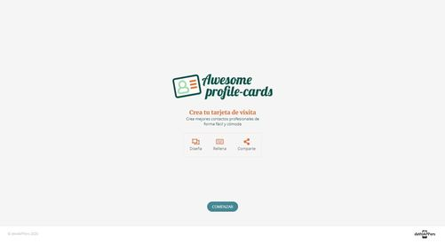
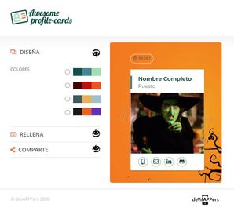
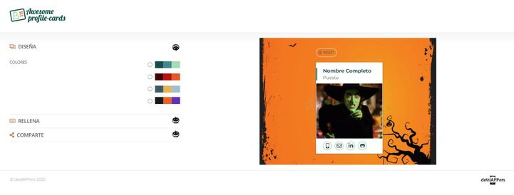

# **ProfileCards**

Module 2 team project of the Adalab Digital Frontend Development Bootcamp

This is a profile cards app developed with `HTML5` , `CSS3` and `JavaScript`.

## **Authors**

This website has been developed by DevilAPPers Team:

- **Almudena Blanco:** [@almudenabr](https://github.com/almudenabr)
- **Emma Cebada:** [@Emma-cebada](https://github.com/Emma-cebada)
- **Ana Guerra:** [@anaguerraabaroa](https://github.com/anaguerraabaroa)
- **Celia Martín:** [@Celiamf](https://github.com/Celiamf)
- **Irene Rueda:** [@IreneRuedaVega](https://github.com/IreneRuedaVega)

## **Quick start guide**

Instructions to start this project:

### **Pre-requirements**

This project is run with Adalab Starter Kit [**here**](https://github.com/Adalab/adalab-web-starter-kit).

In order to use this kit it is needed to previously install [**`node.js`**](https://nodejs.org/es/), [**`git`**](https://git-scm.com/) and [**`gulp.js`**](https://gulpjs.com/) to automate tasks and control project versions.

### **Installation**

1. Clone repository
2. Open a terminal
3. Run `npm install` on the terminal to install local dependencies

### **Run project**

Run `npm start` on the terminal.

This command has to be run everytime the project is started in order to:

1. Open the project on the browser using a local server.
2. Refresh browser everytime files contained in `/src` folder are updated.

### **Deployment**

1. Run these commands to update changes on the project:

```
git add -A
git commit -m "Message commit"
git push
```

2. Run `npm run docs` to create `/docs` folder and the production environment version.

3. Run again commands on step 1 to update changes on the project.

4. Project **[URL](https://anaguerraabaroa.github.io/ProfileCards/)** is also available on GitHub Pages.

## **Development technologies**

- [**`HTML5`**](https://html.spec.whatwg.org/)
- [**`CSS3`**](https://www.w3.org/Style/CSS/)
- [**`JavaScript`**](https://www.ecma-international.org/ecma-262/)

## **Exercise development requirements**

- Landing page
- Generator card page
- Collapsable design sections: colour palettes, personal data form and create profile card
- Control patterns on form inputs
- Render data on card while it is being filled
- Keep data on LocalStorage
- Reset button to remove data from design sections, card and LocalStorage
- Send data to APIRest and get a link with filled profile card
- Button to share card on Twitter

## **Folder Structure**

```
ProfileCards
├── docs
├── node_modules
├── src
│   ├── html
│   │   ├── partials
│   │   │   ├── footer.html
│   │   │   ├── header.html
│   │   │   ├── mainCard.html
│   │   │   ├── mainDesign.html
│   │   │   ├── mainForm.html
│   │   │   ├── mainLanding.html
│   │   │   ├── mainOptions.html
│   │   │   ├── mainProfileCards.html
│   │   │   ├── mainShare.html
│   │   │   └── menu.html
│   │   ├── index.html
│   │   └── profileCards.html
│   ├── images
│   │    ├── card_desktop.jpg
│   │    ├── card_mobile.jpg
│   │    ├── card_tablet.jpg
│   │    ├── default_image.gif
│   │    ├── landing_desktop.jpg
│   │    ├── landing_mobile.jpg
│   │    ├── landing_tablet.jpg
│   │    ├── logo-adalab.png
│   │    ├── logo-awesome-profile-cards.svg
│   │    └── logo-devilappers.svg
│   ├── js
│   │    ├── 01main.js
│   │    ├── 02get-avatar.js
│   │    ├── 03collapsables.js
│   │    ├── 04Form.js
│   │    ├── 05palette.js
│   │    ├── 06sharebutton.js
│   │    ├── 07shareborder.js
│   │    ├── 08Fetch.js
│   │    └── 09LocalStorage.js
│   └── scss
│       ├── components
│       │   ├── _arrow.scss
│       │   ├── _code.scss
│       │   ├── _colorOptions.scss
│       │   ├── _hidden.scss
│       │   ├── _links.scss
│       │   ├── _mainForm.scss
│       │   └── _menu.scss
│       ├── core
│       │   ├── _reset.scss
│       │   └── _variables.scss
│       ├── layout
│       │   ├── _footer.scss
│       │   ├── _header.scss
│       │   ├── _mainCard.scss
│       │   ├── _mainDesign.scss
│       │   ├── _mainLanding.scss
│       │   ├── _mainOptions.scss
│       │   ├── _mainProfileCards.scss
│       │   ├── _mainShare.scss
│       │   └── _page.scss
│       └── main.scss
├── .browserslistrc
├── .csscomb.json
├── .eslintrc.json
├── .gitignore
├── config.json
├── gulp-flow.png
├── gulpfile.js
├── LICENSE
├── package-lock.json
├── package.json
├── README.md
└── robots.txt
```

## **Listeners and functions**

### **Collapsables**

- **Event listener:** arrowList[i].addEventListener("click", getCollapsable)
- **Handle collapsables and turn arrows:** function getCollapsable(event)
- **Event listener share section:** btnShare.addEventListener("click", createCard)
- **Handle card link and Twitter button:** function showLink()
- **Event listener share section border:** menu.addEventListener("click", shareBorder)
- **Handle share section border:** function shareBorder()

### **Palettes**

- **Event listener:**
  - palette1.addEventListener("click", selectPalette1)
  - palette2.addEventListener("click", selectPalette2)
  - palette3.addEventListener("click", selectPalette3)
  - palette4.addEventListener("click", selectPalette4)
- **Handle selected colour palette:** function changeColors()
- **Render colour palette on the profile card:**
  - function selectPalette1()
  - function selectPalette2()
  - function selectPalette3()
  - function selectPalette4()
- **Reset colour palettes:** function erasePalettes()

### **Form**

- **Event listener:** function listenSaveField()
- **Handle form fields data:** function saveField(event)
- **Render form fields data on the profile card:** function paintCard()

### **Form image**

- **Event listener image upload :** uploadBtn.addEventListener("click", fakeFileClick)
- **Handle image upload:** function fakeFileClick()
- **Event listener get image :** fileField.addEventListener("change", getImage)
- **Handle get image:** function getImage(e)
- **Render image on the profile card**: function writeImage()

### **Reset**

- **Event listener:** resetButton.addEventListener("click", handleReset)
- **Handle reset:** const handleReset

### **Create card**

- **Event listener:** btnShare.addEventListener("click", createCard)
- **Handle collapsable create card:** function showLink()
- **Handle function create card and send request to API:** function createCard()

### **Fetch request**

- **Handle API request:** function createCard()
- **Render API response:** function showURL(result)

### **LocalStorage**

- **Set data in LocalStorage:** function setLocalStorage()
- **Get data from LocalStorage:** function getLocalStorage()

## **Result**

  

  
