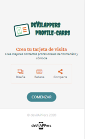
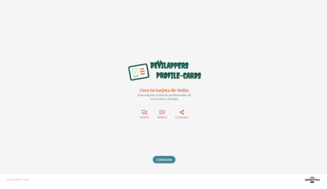
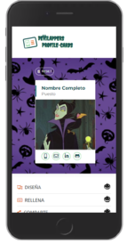
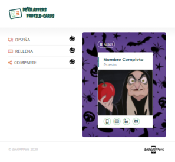
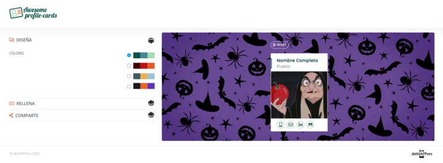

# **Profile Cards**

Module 2 team project of the Adalab Digital Frontend Development Bootcamp.

This is a profile cards app developed with [](https://html.spec.whatwg.org/) [](https://www.w3.org/Style/CSS/) and [](https://www.ecma-international.org/ecma-262/).

**NOTE**: [**original project**](https://github.com/Adalab/project-promo-k-module-2-team-6) has been updated to improve development and design features.

## **Authors**

This project has been developed by DevilAPPers Team:

- **Almudena Blanco:** [@almudenabr](https://github.com/almudenabr)
- **Emma Cebada:** [@Emma-cebada](https://github.com/Emma-cebada)
- **Ana Guerra:** [@anaguerraabaroa](https://github.com/anaguerraabaroa)
- **Celia Martín:** [@Celiamf](https://github.com/Celiamf)
- **Irene Rueda:** [@IreneRuedaVega](https://github.com/IreneRuedaVega)

## **Quick start guide**

Instructions to start this project:

### **Pre-requirements**

This project runs with Adalab Starter Kit [**here**](https://github.com/Adalab/adalab-web-starter-kit).

In order to use this kit it is needed to previously install [](https://nodejs.org/es/), [](https://git-scm.com/) and [](https://gulpjs.com/) to automate tasks and control project versions.

### **Installation**

1. Clone repository
2. Open a terminal
3. Run `npm install` on the terminal to install local dependencies

### **Run project**

Run `npm start` on the terminal:

1. Open the project on the browser using a local server.
2. Refresh browser everytime files contained in `/src` folder are updated.

### **Updating**

1. Run these commands to update changes on the project:

```
git add -A
git commit -m "Message commit"
git push
```

2. Run `npm run docs` to create `/docs` folder and the production environment version.

3. Run again commands on step 1 to update changes on the project.

4. Project **[URL](https://anaguerraabaroa.github.io/profile-cards/)** is also available on GitHub Pages.

## **Project features**

- Landing page
- Generator card page
- Collapsable design sections: colour palettes, personal data form and create profile card
- Control patterns on form inputs
- Render data on card while it is being filled
- Keep data on LocalStorage
- Reset button to remove data from design sections, card and LocalStorage
- Send data to APIRest and get a link with filled profile card
- Button to share card on Twitter

## **Folder Structure**

```
ProfileCards
├── docs
├── node_modules
├── src
│   ├── html
│   │   ├── partials
│   │   │   ├── footer.html
│   │   │   ├── header.html
│   │   │   ├── mainCard.html
│   │   │   ├── mainDesign.html
│   │   │   ├── mainForm.html
│   │   │   ├── mainLanding.html
│   │   │   ├── mainOptions.html
│   │   │   ├── mainProfileCards.html
│   │   │   ├── mainShare.html
│   │   │   └── menu.html
│   │   ├── index.html
│   │   └── profileCards.html
│   ├── images
│   │    ├── card_desktop.jpg
│   │    ├── card_mobile.jpg
│   │    ├── card_tablet.jpg
│   │    ├── default_image.gif
│   │    ├── landing_desktop.jpg
│   │    ├── landing_mobile.jpg
│   │    ├── landing_tablet.jpg
│   │    ├── logo-adalab.png
│   │    ├── logo-awesome-profile-cards.svg
│   │    └── logo-devilappers.svg
│   ├── js
│   │    ├── 01collapsables.js
│   │    ├── 02palettes.js
│   │    ├── 03form.js
│   │    ├── 04card-image.js
│   │    ├── 05create-card.js
│   │    ├── 06fetch.js
│   │    └── 07localStorage.js
│   └── scss
│       ├── components
│       │   ├── _colorOptions.scss
│       │   ├── _mainForm.scss
│       │   └── _mainOptionsMenu.scss
│       ├── core
│       │   ├── _reset.scss
│       │   └── _variables.scss
│       ├── layout
│       │   ├── _footer.scss
│       │   ├── _header.scss
│       │   ├── _mainCard.scss
│       │   ├── _mainDesign.scss
│       │   ├── _mainLanding.scss
│       │   ├── _mainOptions.scss
│       │   ├── _mainProfileCards.scss
│       │   ├── _mainShare.scss
│       │   └── _page.scss
│       └── main.scss
├── .browserslistrc
├── .csscomb.json
├── .eslintrc.json
├── .gitignore
├── config.json
├── gulp-flow.png
├── gulpfile.js
├── LICENSE
├── package-lock.json
├── package.json
├── README.md
└── robots.txt
```

## **Listeners and functions**

### **Collapsables**

- **Event listener:** arrowList[i].addEventListener("click", getCollapsable)
- **Handle collapsables and turn pumpkins:** function getCollapsable(event)

### **Palettes**

- **Event listener:**
  - palette1.addEventListener("click", selectPalette)
  - palette2.addEventListener("click", selectPalette)
  - palette3.addEventListener("click", selectPalette)
  - palette4.addEventListener("click", selectPalette)
- **Handle select palette:**
  - function selectPalette()
- **Render selected palette on card:** function renderPalette()
- **Reset palettes:** function resetPalette()

### **Form**

- **Save form field event listener:** function listenSaveField()
- **Handle form fields data:** function saveField(event)
- **Render form fields data on the profile card:** renderCard()
- **Reset button event listener:** resetButton.addEventListener("click", handleReset)
- **Handle reset:** const handleReset

### **Card image**

- **Upload image event listener:** uploadBtn.addEventListener("click", fakeFileClick)
- **Handle an automatic click on hidden input when an image is uploaded:** function fakeFileClick()
- **Get image event listener:** fileField.addEventListener("change", getImage)
- **Handle get image from hidden input:** function getImage(e)
- **Render image on the profile card**: function writeImage()

### **Create card**

- **Share collapsable container event listener:** shareCollapsableBorder.addEventListener("click", hideShareBorder);
- **Handle share collapsable container border:** function hideShareBorder()
- **Create card button event listener:** btnShare.addEventListener("click", createCard)
- **Handle collapsable card link and change create card button colour:** function showLink()
- **Handle function create card and send request to API:** function createCard()

### **Fetch**

- **Send API request event listener:** createCardbtn.addEventListener("click", sendRequest)
- **Handle API request:** sendRequest()
- **Render API response:** function showURL(result)
- **Twitter button event listener:** twitterButton.addEventListener("click", createTwitterLink)
- **Share card link on Twitter:** function createTwitterLink(result)

### **LocalStorage**

- **Set data in LocalStorage:** function setLocalStorage()
- **Get data from LocalStorage:** function getLocalStorage()

## **Screenshots**

  

  

## **License**

This project is licensed under [**MIT License**](https://spdx.org/licenses/MIT.html).
