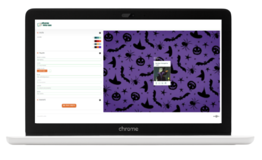

  

  

# **Profile Cards**

## **About**

Module 2 team project of the Adalab Digital Frontend Development Bootcamp.

This is a profile cards app developed with [](https://html.spec.whatwg.org/) [](https://www.w3.org/Style/CSS/) [](https://sass-lang.com/) and [](https://www.ecma-international.org/ecma-262/)

**[Project URL](https://anaguerraabaroa.github.io/profile-cards/)** is available on GitHub Pages.

**NOTE**: [**original project**](https://github.com/Adalab/project-promo-k-module-2-team-6) has been updated to improve development and design features.

## **DevilAPPers Team**

This project has been developed by DevilAPPers Team:

- **Almudena Blanco:** [@almudenabr](https://github.com/almudenabr)
- **Emma Cebada:** [@Emma-cebada](https://github.com/Emma-cebada)
- **Ana Guerra:** [@anaguerraabaroa](https://github.com/anaguerraabaroa)
- **Celia Martín:** [@Celiamf](https://github.com/Celiamf)
- **Irene Rueda:** [@IreneRuedaVega](https://github.com/IreneRuedaVega)

## **Quick start guide**

Instructions to start this project:

## Installation

- Clone repository:

```
git clone [repository]
```

- Install NPM packages and dependencies:

```
npm install
```

- Run project on local server:

```
npm start
```

## **Features**

- Landing page
- Generator card page
- Collapsable design sections: colour palettes, personal data form and create profile card
- Control patterns on form inputs
- Render data on card while it is being filled
- Keep data on LocalStorage
- Reset button to remove data from design sections, card and LocalStorage
- Send data to APIRest and get a link with filled profile card
- Button to share card on Twitter

## **Usage**

### **1. Collapsables**

```javascript
function getCollapsable(event) {
  event.currentTarget.classList.toggle("rotateArrow");

  const arrowId = event.currentTarget.id;
  const section = document.querySelector(".section-" + arrowId);
  section.classList.toggle("hideCollapsable");
}
```

### **2. Palettes**

- **Handle select palette:**

```javascript
function selectPalette() {
  if (palette1.checked === true) {
    form.palette = 1;
  } else if (palette2.checked === true) {
    form.palette = 2;
  } else if (palette3.checked === true) {
    form.palette = 3;
  } else if (palette4.checked === true) {
    form.palette = 4;
  }

  renderPalette();
  setLocalStorage();
}
```

- **Render selected palette on card:**

```javascript
function renderPalette() {
  cardContainer.classList.add("palette1");
  cardContainer.classList.remove("palette2");
  cardContainer.classList.remove("palette3");
  cardContainer.classList.remove("palette4");
  if (form.palette === 1) {
    cardContainer.classList.add("palette1");
  } else if (form.palette === 2) {
    cardContainer.classList.add("palette2");
  } else if (form.palette === 3) {
    cardContainer.classList.add("palette3");
  } else if (form.palette === 4) {
    cardContainer.classList.add("palette4");
  }
}
```

- **Reset palettes:**

```javascript
function resetPalette() {
  if (palette1.checked !== true) {
    palette1.checked = true;
  } else if (palette2.checked === true) {
    palette2.checked = false;
  } else if (palette3.checked === true) {
    palette3.checked = false;
  } else if (palette4.checked === true) {
    palette4.checked = false;
  }
  renderPalette();
}
```

### **3. Form**

- **Handle form fields data:**

```javascript
function saveField(event) {
  inputValue = event.currentTarget.value;
  inputId = event.currentTarget.id;
  form[inputId] = inputValue;
  renderCard();
  setLocalStorage();
}
```

- **Render form fields data on the profile card:**

```javascript
function renderCard() {
  document.querySelector(".js-nameCard").innerHTML =
    form.name || "Nombre completo";
  document.querySelector(".js-positionCard").innerHTML = form.job || "Puesto";
  document.querySelector(".js-tlCard").href = "tel:" + form.phone;
  document.querySelector(".js-emailCard").href = "mailto:" + form.email;
  document.querySelector(".js-linkedinCard").href = form.linkedin;
  document.querySelector(".js-gitHubCard").href =
    "https://github.com" + form.github;
  profileImage.style.backgroundImage = `url(${form.photo})`;
}
```

- **Handle reset form fields:**

```javascript
const handleReset = function () {
  form.palette = 1;
  form.name = "";
  form.job = "";
  form.email = "";
  form.phone = "";
  form.linkedin = "";
  form.github = "";
  form.photo =
    "url(https://i.picasion.com/pic90/02b56d6431f0a6fe7082958c95d7788d.gif)";
  localStorage.removeItem("formData");
  for (const input of inputList) {
    input.value = "";
  }
  profileImage.style.backgroundImage =
    "url(https://i.picasion.com/pic90/02b56d6431f0a6fe7082958c95d7788d.gif)";
  profilePreview.style.backgroundImage =
    "url(https://i.picasion.com/pic90/02b56d6431f0a6fe7082958c95d7788d.gif)";

  renderCard();
  resetPalette();
  setLocalStorage();
};
```

### **4. Card image**

- **Handle an automatic click on hidden input when an image is uploaded:**

```javascript
function fakeFileClick() {
  fileField.click();
}
```

- **Handle get image from hidden input:**

```javascript
function getImage(e) {
  const myFile = e.currentTarget.files[0];
  fr.addEventListener("load", writeImage);
  fr.readAsDataURL(myFile);
}
```

- **Render image on the profile card:**

```javascript
function writeImage() {
  profileImage.style.backgroundImage = `url(${fr.result})`;
  profilePreview.style.backgroundImage = `url(${fr.result})`;
  form.photo = fr.result;
  setLocalStorage();
}
```

### **5. Create card**

- **Handle share collapsable container border:**

```javascript
function hideShareBorder() {
  shareCollapsableBorder.classList.toggle("hideLineShare");
}
```

- **Handle collapsable card link and change create card button colour:**

```javascript
function showLink() {
  createCardbtn.classList.add("btnClick");
  createCardCollapsable.classList.remove("hideCollapsable");
}
```

### **6. Fetch**

- **Handle API request:**

```javascript
function sendRequest() {
  fetch("https://us-central1-awesome-cards-cf6f0.cloudfunctions.net/card/", {
    method: "POST",
    body: JSON.stringify(form),
    headers: {
      "content-type": "application/json",
    },
  })
    .then(function (resp) {
      return resp.json();
    })
    .then(function (result) {
      showURL(result);
    })
    .catch(function (error) {
      console.log(error);
      cardLink.innerHTML = "Error en el servidor";
    });
}
```

- **Render API response:**

```javascript
function showURL(result) {
  if (result.success) {
    cardLink.href = result.cardURL;
    cardLink.innerHTML = cardLink.href;
  } else {
    cardLink.innerHTML = "ERROR: " + result.error;
  }
}
```

- **Share card link on Twitter:**

```javascript
function createTwitterLink(result) {
  const twitterText = encodeURIComponent(
    "¡Ya formo parte del mundo de las sombras gracias a DevilAPPers Profile Cards!:"
  );
  const twitterURL = cardLink.innerHTML;
  twitterButton.href = `https://twitter.com/intent/tweet?text=${twitterText}&url=${twitterURL}`;
}
```

### **7. LocalStorage**

- **Set data in LocalStorage:**

```javascript
function setLocalStorage() {
  localStorage.setItem("formData", JSON.stringify(form));
}
```

- **Get data from LocalStorage:**

```javascript
function getLocalStorage() {
  const localFormData = JSON.parse(localStorage.getItem("formData"));
  if (localFormData !== null) {
    form = localFormData;
    document.querySelector(".js-nameInput").value = form.name;
    document.querySelector(".js-positionInput").value = form.job;
    document.querySelector(".js-tlInput").value = form.phone;
    document.querySelector(".js-emailInput").value = form.email;
    document.querySelector(".js-linkedinInput").value = form.linkedin;
    document.querySelector(".js-gitHubInput").value = form.github;
    profileImage.style.backgroundImage = `url(${form.photo})`;
    profilePreview.style.backgroundImage = `url(${form.photo})`;
    const selectedPalette = document.querySelector("#palette" + form.palette);
    selectedPalette.click();
  }
  renderCard();
  listenSaveField();
}
```

## **Folder Structure**

```
Profile Cards
├── docs
├── node_modules
├── src
│   ├── html
│   │   ├── partials
│   │   │   ├── footer.html
│   │   │   ├── header.html
│   │   │   ├── mainCard.html
│   │   │   ├── mainDesign.html
│   │   │   ├── mainForm.html
│   │   │   ├── mainLanding.html
│   │   │   ├── mainOptions.html
│   │   │   ├── mainProfileCards.html
│   │   │   ├── mainShare.html
│   │   │   └── menu.html
│   │   ├── index.html
│   │   └── profileCards.html
│   ├── images
│   │    ├── card_desktop.png
│   │    ├── card_mobile.png
│   │    ├── card_tablet.png
│   │    ├── default_image.gif
│   │    ├── landing_desktop.png
│   │    ├── landing_mobile.png
│   │    ├── landing_tablet.png
│   │    ├── logo-adalab.png
│   │    ├── logo-awesome-profile-cards.svg
│   │    └── logo-devilappers.svg
│   ├── js
│   │    ├── 01collapsables.js
│   │    ├── 02palettes.js
│   │    ├── 03form.js
│   │    ├── 04card-image.js
│   │    ├── 05create-card.js
│   │    ├── 06fetch.js
│   │    └── 07localStorage.js
│   └── scss
│       ├── components
│       │   ├── _colorOptions.scss
│       │   ├── _mainForm.scss
│       │   └── _mainOptionsMenu.scss
│       ├── core
│       │   ├── _reset.scss
│       │   └── _variables.scss
│       ├── layout
│       │   ├── _footer.scss
│       │   ├── _header.scss
│       │   ├── _mainCard.scss
│       │   ├── _mainDesign.scss
│       │   ├── _mainLanding.scss
│       │   ├── _mainOptions.scss
│       │   ├── _mainProfileCards.scss
│       │   ├── _mainShare.scss
│       │   └── _page.scss
│       └── main.scss
├── .browserslistrc
├── .csscomb.json
├── .eslintrc.json
├── .gitignore
├── config.json
├── gulp-flow.png
├── gulpfile.js
├── LICENSE
├── package-lock.json
├── package.json
├── README.md
└── robots.txt
```

## **License**

This project is licensed under 
